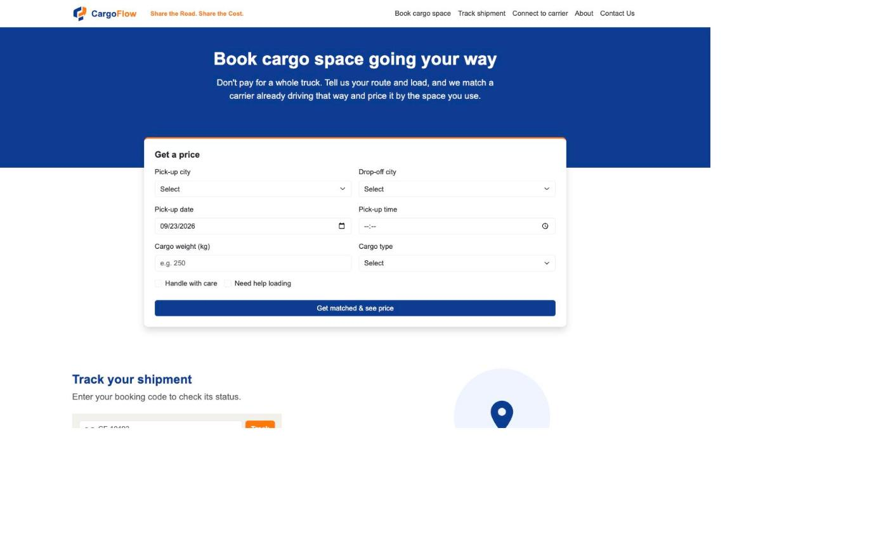
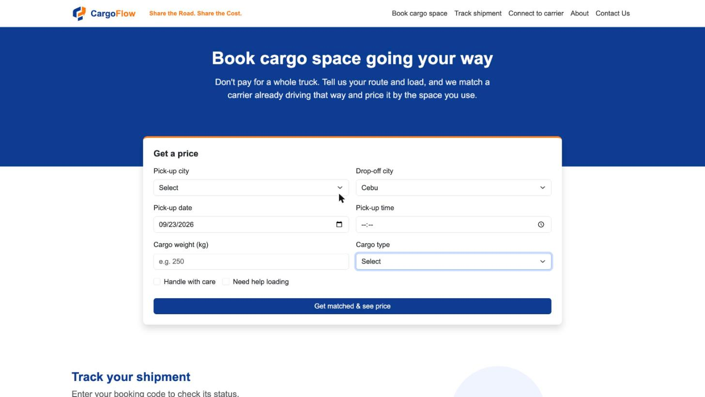
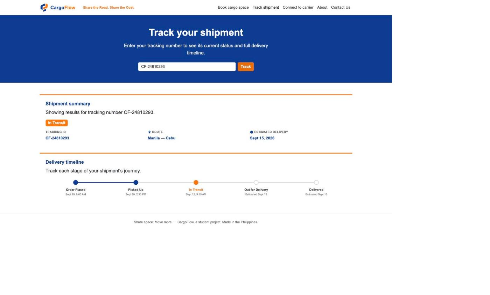

<div align="center">

# CargoFlow

### _Share the Road. Share the Cost._

**A browser-based cargo-sharing platform for the Philippines** — connecting SMEs, online sellers, manufacturers, independent shippers, and local carriers by matching partial shipments with unused truck capacity.


</div>

---

## About the Project

Shipping in the Philippines is expensive — especially for small businesses that can't fill an entire truck. Meanwhile, carriers often drive routes with **unused cargo space**.

**CargoFlow** solves both problems at once. Instead of simply booking a truck, CargoFlow **fills unused cargo space** by matching multiple compatible shipments traveling along the same route, based on:

- **Route** — shipments headed the same direction
- **Cargo size** — fits available space
- **Vehicle capacity** — matched to the carrier's truck
- **Delivery schedule** — aligned pickup and drop-off windows

> This project was developed as a requirement for **MO-IT161 – Web Systems and Technology**.

---

## Key Features

| Feature                  | Description                                                       |
| ------------------------ | ----------------------------------------------------------------- |
| **Smart Matching**       | Find compatible shipments and carriers going along the same route |
| **Cost Sharing**         | Split transport costs among multiple shippers sharing one truck   |
| **Cargo Booking**        | Reserve available cargo space in a few clicks                     |
| **Shipment Tracking**    | Monitor shipment status from pickup to delivery                   |
| **Direct Messaging**     | Communicate with carriers directly inside the platform            |
| **Capacity Utilization** | Help carriers earn more by filling empty truck space              |

---

## Target Users

- **SMEs** — small and medium enterprises with partial-load shipments
- **Online Sellers** — e-commerce merchants shipping to customers
- **Manufacturers** — businesses moving goods between locations
- **Independent Shippers** — individuals with occasional cargo needs
- **Local Carriers** — truck owners/operators with unused capacity

---

## Tech Stack

<div align="center">

|      Technology       |                                                      Logo                                                      | Purpose                                     |
| :-------------------: | :----------------------------------------------------------------------------------------------------------: | :------------------------------------------ |
|       **HTML5**       |            | Markup and page structure (`index.html`)    |
|       **CSS3**        |              | Styling, layout, and responsive design      |
| **JavaScript (ES6+)** |  | Icon rendering, mobile nav, and route search |
|  **Node.js + Express** |              | Local web server (`server.js`) that serves the site |
|   **Git & GitHub**    |            | Version control and collaboration           |

</div>

> **Note:** No framework and no build step. Plain HTML, CSS, and
> JavaScript, plus Bootstrap 5 (via CDN) across every page. A basic
> Node.js + Express server (`server.js`) serves the pages; it has no API yet. Shipment
> tracking uses mock data; carrier messaging persists to `localStorage` in
> your own browser. Everything else runs entirely client-side.

---

## Getting Started

### Prerequisites

- [Node.js](https://nodejs.org/) 20 or newer (LTS recommended). Check with `node -v`.
- A modern web browser.

### Run it

```bash
git clone https://github.com/RTavera3/Web-Systems-and-Technology-CargoFlow.git
cd Web-Systems-and-Technology-CargoFlow
npm install
npm run dev
```

Then open **http://localhost:3000**. `npm run dev` restarts the server when a file
changes; `npm start` runs it without watching. To use another port, set `PORT`
(for example `PORT=8080 npm start`).

The server only serves the front-end folders (`css/`, `js/`, `pages/`, `resources/`)
and `index.html`, so `server.js`, `package.json` and `node_modules/` are never
reachable from the browser. Serving over `http://` also lets the booking page load
`resources/users.json`, which browsers block when the HTML file is opened directly.

### About the pages

`index.html` (project root) is the Home page — Bootstrap 5 navbar, hero with
a floating "Get a price" quote card, a shipment-tracking widget, a carrier
CTA, and an About section. Every other page lives under `pages/`:
`contact.html`, `booking-details.html`, `payment.html`, `messages.html`
(carrier chat with `localStorage`-backed history), and `trackshipment.html`
(the full tracking page, separate from the home page's quick widget).

The design follows the CargoFlow brand palette: deep blue (`#0B3D91`) and
flow orange (`#FF7A00`), with sand (`#F4F1EA`) as a secondary background.
Icons are inline SVG (no icon font/CDN) to keep the site's look consistent
and working offline.

**Prototype scope:** shipment tracking and pricing use mock data; there's no
backend, database, or real payment processing. No API keys are needed to run
it.

Fonts load from Google Fonts, which receives normal browser request
metadata; system sans-serif fallbacks are used when offline.

---

## Project Structure

```
Web-Systems-and-Technology-CargoFlow/
├── server.js                     # Node.js + Express server that serves the site (npm run dev)
├── package.json                  # Project info, npm scripts, Express dependency
├── index.html                    # Home page: hero, quote form, track widget, carrier CTA, about
├── css/
│   └── theme.css                 # Shared Bootstrap theme overrides for every page (navy/orange brand)
├── js/
│   ├── track.js                  # Home page's quick shipment-tracking widget
│   ├── trackshipment.js          # Full tracking page logic (pages/trackshipment.html)
│   └── messages.js               # Carrier chat logic (pages/messages.html)
├── pages/
│   ├── contact.html              # Contact form
│   ├── booking-details.html      # Cargo/address details step of the booking flow
│   ├── payment.html              # Payment step of the booking flow
│   ├── messages.html             # Carrier messaging UI
│   └── trackshipment.html        # Full shipment-tracking page
└── resources/
    └── cargoflow.logo.png        # Brand logo asset
```

`index.html` stays at the project root (so `index.html` loads by default from any static host);
every other page lives under `pages/`. Pages link to each other with plain relative paths — no
build step, router, or bundler is involved.

---

## Core Pages

1. **Home** — platform overview and quick search
2. **Book Cargo Space** — reserve space and view shared cost breakdown
3. **Track Shipment** — see shipment status and timeline
4. **Shipment History** - for viewing active and past bookings. 
5. **Messages** — chat directly with carriers

---

## Screenshots

|                Home                 |               Book Cargo                |              Tracking               |
| :----------------------------------: | :--------------------------------------: | :-----------------------------------: |
|  |  |  |

---

## Team

| Name                  |
| --------------------- |
| Armielyn Obinguar     |
| Chantal Louise Flor   |
| Mitzi Reese Arrogante |
| Ryan Keneth Tavera    |

---

## Links

| Link Text | Link URL |
| :--- | :--- |
| **Application Development Worksheet** | [Application Development Worksheet](https://docs.google.com/spreadsheets/d/1dY_Oe7DcTmbCF5gs7h_8In5pB499XdTnBrwlWs6sxXw/edit?usp=sharing) |
| **Project Plan** | [Project Plan](https://docs.google.com/spreadsheets/d/138MnAb0N5k0tvgI0hg_GSXMYZVBpTThv79Nch-e4GCY/edit?usp=sharing) |
| **AI Use Statement** | [AI Use Statement](https://docs.google.com/document/d/1LYv0N-MkpsaRtzsQQ7X2heC_45hTNs3Z9yNxwxWlT0I/edit?tab=t.0) |

## Course Information

- **Course Code:** MO-IT161
- **Subject:** Web Systems and Technology
- **Term:** Term 1, SY 2026–2027
- **Program:** Bachelor of Science in Information Technology
- **Section:** A3101
- **Institution:** Mapúa Malayan Digital College (MMDC)

---

<div align="center">

Made in the Philippines

</div>
